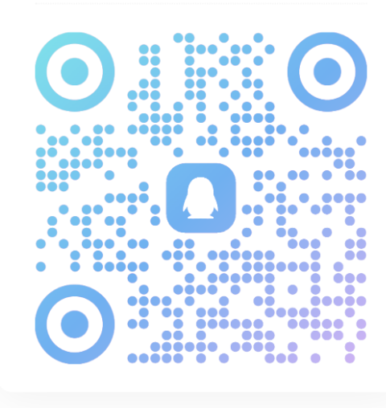

# Blade Cowork

智能协作终端 - AI Agent 驱动的代码协作工具

## 演示视频

[点击下载演示视频](https://github.com/echoVic/blade-cowork-releases/releases/download/v0.0.1/default.mp4)（20MB）

## 功能特性

- AI Agent 驱动的代码协作
- MCP (Model Context Protocol) 支持
- 丰富的内置工具（文件操作、搜索、Shell 等）
- 多主题支持
- Skills 动态扩展系统

## 下载

从 [Releases](https://github.com/echoVic/blade-cowork-releases/releases) 页面下载对应架构的安装包：

### macOS
- **Apple Silicon (M1/M2/M3)**: `Blade Cowork-x.x.x-arm64.zip`
- **Intel Mac**: `Blade Cowork-x.x.x-x64.zip`

### 首次打开提示"已损坏"的解决方法

由于应用未经 Apple 签名，首次打开可能会提示：

> "Blade Cowork" 已损坏，无法打开。你应该将它移到废纸篓。

**方法一：右键打开（推荐）**

1. 在 Finder 中找到 `Blade Cowork.app`
2. 按住 **Control** 键，同时点击应用图标（或右键点击）
3. 在菜单中选择 **打开**
4. 在弹出的对话框中点击 **打开**

之后就可以正常双击打开了。

**方法二：使用终端命令**

```bash
# 进入应用所在目录
cd /Applications  # 或你解压的目录

# 清除隔离属性（二选一）
xattr -c Blade\ Cowork.app

# 或者递归清除所有文件
sudo find Blade\ Cowork.app -exec xattr -c {} \;
```

**方法三：系统设置**

1. 尝试打开应用（会被阻止）
2. 打开 **系统设置** > **隐私与安全性**
3. 滚动到底部，找到 "Blade Cowork" 被阻止的提示
4. 点击 **仍要打开**

## 交流群

| 微信群 | QQ群 (472309526) |
|:---:|:---:|
|  |  |

## 许可证

MIT License
